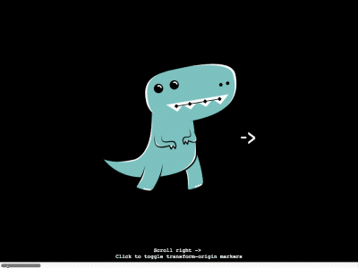

# TweenRex

*Reactive Tweening Engine*

[](https://badge.fury.io/js/tweenrex)
[](https://travis-ci.org/notoriousb1t/tweenrex)
[](https://www.npmjs.com/package/tweenrex)
[](https://unpkg.com/tweenrex/dist/tweenrex.min.js)



## Features

 - Playback controls: play, pause, reverse, playbackRate, seek, labels, etc.
 - Animate anything with render functions
 - Scroll sync any element to an animation, not just the documentElement
 - Simple Reactive API with no strings attached
 - Super tiny with plans to stay that way
 - Free for commercial and non-commerical use under the MIT license

## Demos
- TweenRex: [Check your Heart with TweenRex + Polymorph](https://codepen.io/notoriousb1t/pen/dZveGQ?editors=1010)
- TyrannoScrollus: [Syncing Horizontal Scroll with TweenRex](https://codepen.io/notoriousb1t/pen/0c5c1b7697377d12019ca4f091e2e669)

## How to Use

### TweenRex
Creates a new time Observable that tweens for a set period of time.

```js
// create an observable
const t1 = TweenRex({
    duration: 1000
})

// subscribe to changes in the time of the animation
t1.subscribe(offset => {
    // offset is a number between 0 and 1 representing 0% to 100% of time
    // todo: write some code
})

// use playback controls to tween
t1.play()
```

#### options
Name | Description |
--- | --- |
distinct | When true, subsequent values will be ignored if they are the same as the previous value.  The default is true. |
duration | The duration of the tween in milliseconds |
frameSize | Enforces a fixed amount of time per frame.  If ```0```, Tweens will use actual deltas and attempt to sync to requestAnimationFrame.  The default value is ```0```. |
labels | A dictionary of named times used for seeking |
scheduler | The observable that provides new time deltas.  If ```undefined```, the Tween will use a default scheduler.  The default value is ```undefined```.  |

### Properties
Name | Description |
--- | --- |
currentTime | The current time of the Tween |
duration | The total duration of the Tween |
isPlaying | If true, TweenRex is actively playing |
playbackRate | The rate at which the Tween is playing. The default value is 1 meaning 100% speed. |

### Functions

#### play()
Starts tweening until the duration is reached.
#### pause()
Pauses the tween.

#### reverse()
Flips the playbackRate to the opposite direction.

#### getLabel(name)
Gets the time for a label.

#### setLabel(name, time)
Sets a label at the time specified.  Set to undefined to clear the label

#### seek(timeOrLabel)
Seeks to the time or label.  If the resolved time is not within the range of the tween, it will be clamped to either ```0``` or the ```duration```.

#### subscribe(observer | observer[])
Subscribes the observer to changes in the value.  The value provided is a number between 0 and 1 representing 0% to 100% of time elapsed.  This value can be passed to renderer functions such as the ones [Polymorph](https://github.com/notoriousb1t/polymorph) provides.

```js
var tween = TweenRex({ duration: 1000 })
var target = document.querySelector('#target')
var svgRenderer = polymorph.interpolate(['#first path', '#second path'])

tween.subscribe(o => {
    target.setAttribute('d', svgRenderer(o))
});

tween.play();
```

This returns a function that unsubscribes:

```js
var tween = new TweenRex(...)
var unsubscribe = tween.subscribe(o => ...);

// call unsubscribe
unsubscribe();
```

### TyrannoScrollus
Creates a scroll Observable that updates based on scroll position of an element.

```js
// create an observable
const t1 = TyrannoScrollus({
    targets: '#myTarget'
})

// subscribe to changes to the scroll position of an element
t1.subscribe(offset => {
    // offset is a number between 0 and 1 representing 0% to 100% of scroll position
    // todo: write some code
})

// start listening
t1.play()
```

#### options
Name | Description |
--- | --- |
distinct | When true, subsequent values will be ignored if they are the same as the previous value.  The default is true. |
direction| The axis to observe.  'x' detects scrolling horizontally and 'y' detects scrolling vertically.  'y' is the default.|
scheduler | The observable that provides new time deltas.  If ```undefined```, it will use a default scheduler.  The default value is ```undefined```.  |
targets|An element or selector to observe scroll position|

### Properties
Name | Description |
--- | --- |
isPlaying | If true, the target is being watched |
target | The active target being watched |

### Functions

#### play()
Starts watching for changes in the scroll position
#### pause()
Stops watching for changes in the scroll position

#### subscribe(observer | observer[])
Subscribes the observer to changes in the value.  The value provided is a number between 0 and 1 representing 0% to 100% of scroll position.  This value can be passed to renderer functions such as the ones [Polymorph](https://github.com/notoriousb1t/polymorph) provides.

```js
var target = document.querySelector('#target')

var tween = TyrannoScrollus({ targets: target })
var svgRenderer = polymorph.interpolate(['#first path', '#second path'])

tween.subscribe(o => {
    target.setAttribute('d', svgRenderer(o))
});

tween.play();
```

This returns a function that unsubscribes:

```js
var unsubscribe = tween.subscribe(o => ...);

// call unsubscribe
unsubscribe();
```

## Setup

### Setup for CDN
Include this script.  It will add TweenRex and TyrannoScrollus to the window.
```html
<script src="https://unpkg.com/tweenrex/dist/tweenrex.min.js"></script>
```

### Setup for NPM

Run this command to install from npm.
```bash
npm install tweenrex --save
```

Then import from the module
```js
import { TweenRex, TyrannoScrollus } from 'tweenrex'
```
## License
This library is licensed under MIT.

## Contributions / Questions
Please create an issue for questions or to discuss new features.
