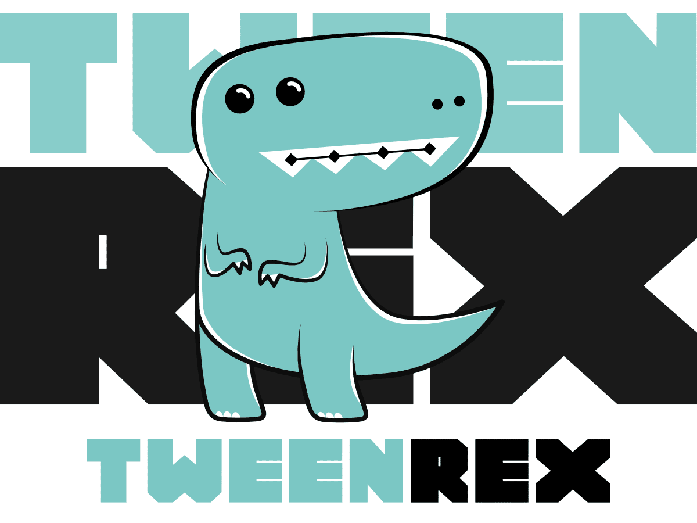
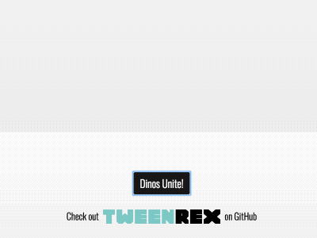

# TweenRex

*Reactive Tweening Engine*



## Features

 - Playback controls: play, pause, reverse, playbackRate, seek, labels, etc.
 - Animate anything with render functions
 - Scroll sync any element to an animation, not just the documentElement
 - Simple Reactive API with no strings attached
 - Super tiny with plans to stay that way
 - Free for commercial and non-commerical use under the MIT license


## Demos
- [Check your Heart with TweenRex + Polymorph](https://codepen.io/notoriousb1t/pen/dZveGQ)
- [Dinos Unite! (Sub-tweens with TweenRex)](https://codepen.io/shshaw/pen/mqMRbE)
- [Syncing Horizontal Scroll with TweenRex](https://codepen.io/shshaw/pen/jaLqBB)
- **[View All Demos](docs/api/examples.md)**

<table width="100%">
<tr>
<td width="50%">
  <a href="https://codepen.io/shshaw/pen/mqMRbE">
   
   <br />
   Dinos Unite! (Sub-tweens with TweenRex)
 </a>
</td>
<td width="50%">
  <a href="https://codepen.io/shshaw/pen/jaLqBB?editors=0010">
   
   <br />
   Syncing Horizontal Scroll with TweenRex
  </a>
</td>
</tr>
</table>

## Documentation

Name | Description |
--- | --- |
[TweenRex](/docs/api/TweenRex.md) | Animate over time with complex choregraphy.  Includes sub-tweens, full replay controls, seeking, and playback rate controls. |
[TyrannoScrollus](/docs/api/TyrannoScrollus.md) | Sync animations to horizontal or vertical scroll position of elements |
[TRexObservable](/docs/api/TRexObservable.md) | General Observable for reacting to values over time. BehaviorSubject in RxJs is a close approximation. This is the base class for other types of tweens. |

## Setup through NPM

Install one or more of the following packages by running this command:   ```npm i {package} -S```

Package | Status | Description |
-- | -- | -- |
| @tweenrex/core | [](https://travis-ci.org/tweenrex/core) | This package contains [TweenRex](/docs/api/TweenRex.md), [TyrannoScrollus](/docs/api/TyrannoScrollus.md), and [TRexObservable](/docs/api/TRexObservable.md).  It contains all you need for animation at minimum. |
| @tweenrex/render | [](https://travis-ci.org/tweenrex/render) | This package contains [interpolate](/docs/api/interpolate.md) and other rendering functions.  This package is intended to help reduce boilerplate code and streamline development while creating typical animations. |

## Setup with Prebuilt scripts
Include one or more of these scripts


Link | Description |
-- | -- |
|<a target="_blank" href="https://unpkg.com/tweenrex/dist/tweenrex.min.js">tweenrex.min.js</a> | This script adds TweenRex, TyrannoScrollus, and TRexObservable to the global window variable.  This the a pre-bundled version of @tweenrex/core. |
|<a target="_blank" href="https://unpkg.com/tweenrex/dist/tweenrex-render.min.js">tweenrex-render.min.js</a> | This script adds interpolate to the ```tweenrex``` global window variable.  This is a pre-bundled version of @tweenrex/render. |
|<a target="_blank" href="https://unpkg.com/tweenrex/dist/tweenrex-all.min.js">tweenrex-all.min.js</a> | This script is a combination of all other scripts.  This is meant primarily for code playgrounds like [CodePen](https://codepen.io/). |

## Recommended Helper Libraries
TweenRex handles timing and dealing with values over time, but is built to work with other libraries.  Here are some recommended helper libraries that match up with TweenRex very well.

Name | Type | Description |
--- | --- | --- |
[Flubber](https://github.com/veltman/flubber)| SVG Morph | Morph SVG with this heavy-weight library.  This library does a great job of morphing between very different shapes at runtime. It cannot handle holes in SVG, but it has a large arsenal of helper functions.  It is about 53 KB minified. This is a good choice when smoothness of animation trumps all other needs.|
[Path.js](https://github.com/SamKnows/path.js) | SVG Morph | Simple SVG morphing library that can tween between two paths with matching SVG commands and the same number of segments. It is about 4KB minified.  This library is a good choice when the SVG's are highly optimized for one another.|
[Polymorph](https://github.com/notoriousb1t/polymorph) | SVG Morph | Morph SVG Paths with this lightweight library.  It can support variable length paths in addition to handling holes in SVGs.  It is just under 6KB minified.  It is a good all around choice for performant morphs of highly variable complex paths.|
[Lengthy](https://github.com/shshaw/lengthy-svg) | SVG Draw | Lengthy is a JavaScript microlibrary (1.1kb min, 0.6kb gzipped) to get the length of SVG shapes. The length will automatically be added to the element as a CSS Var to make it easy to do CSS animations of SVG stroke-dashoffset for the wonderful line drawing SVG technique and other interesting animations. |
| [d3-interpolate](https://github.com/d3/d3-interpolate) | Interpolation | Provides a variety of interpolation methods for blending between two values. Values may be numbers, colors, strings, arrays, or even deeply-nested objects. This could easily be used with TweenRex and TyrannoScrollus |
| [nm8](https://github.com/davidkpiano/nm8) | Tweening | This super small tweening library fits in a tweet! This library is compatible with the render package. If you prefer low-level, this is as low as you can get. |

## License
This library is licensed under MIT.

## Contributions / Questions
Please create an issue for questions or to discuss new features.  There are also plenty of helpful people on the #tweenrex channel on the [Animation at Work Slack](https://damp-lake-50659.herokuapp.com).
