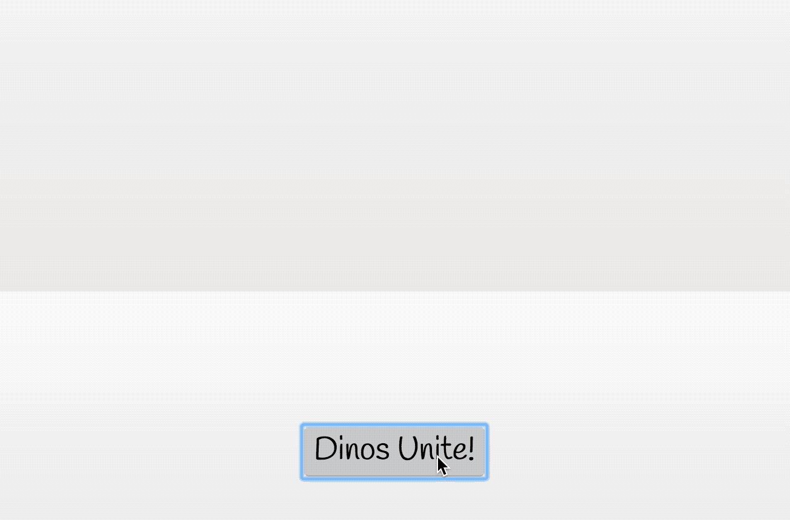

# TweenRex

*Reactive Tweening Engine*


[](https://badge.fury.io/js/tweenrex)
[](https://travis-ci.org/notoriousb1t/tweenrex)
[](https://www.npmjs.com/package/tweenrex)
[](https://unpkg.com/tweenrex/dist/tweenrex.min.js)


## Features

 - Playback controls: play, pause, reverse, playbackRate, seek, labels, etc.
 - Animate anything with render functions
 - Scroll sync any element to an animation, not just the documentElement
 - Simple Reactive API with no strings attached
 - Super tiny with plans to stay that way
 - Free for commercial and non-commerical use under the MIT license


## Demos
- [Check your Heart with TweenRex + Polymorph](https://codepen.io/notoriousb1t/pen/dZveGQ?editors=1010)

- [Dinos Unite! (Sub-tweens with TweenRex)](https://codepen.io/notoriousb1t/pen/zPwqVY?editors=0010)
- [Syncing Horizontal Scroll with TweenRex](https://codepen.io/shshaw/pen/jaLqBB)

<table width="100%">
<tr>
<td width="50%">
    <a href="https://codepen.io/shshaw/pen/jaLqBB?editors=0010"></a>
</td>
<td width="50%">
 <a href="https://codepen.io/notoriousb1t/pen/zPwqVY?editors=0010"></a>
</td>
</tr>
</table>

## Documentation

Name | Description |
--- | --- |
[TweenRex](/docs/api/TweenRex.md) | Animate over time with complex choregraphy.  Includes sub-tweens, full replay controls, seeking, and playback rate controls. |
[TyrannoScrollus](/docs/api/TyrannoScrollus.md) | Sync animations to horizontal or vertical scroll position of elements |
[TRexObservable](/docs/api/TRexObservable.md) | General Observable for reacting to values over time. BehaviorSubject in RxJs is a close approximation. This is the base class for other types of tweens. |

## Setup

### Setup for CDN
Include this script.  It will add TweenRex, TyrannoScrollus, and TRexObservable to the window.
```html
<script src="https://unpkg.com/tweenrex/dist/tweenrex.min.js"></script>
```

### Setup for NPM

Run this command to install from npm, and then import from the module
```bash
npm install @tweenrex/core --save
```
```js
import { TweenRex, TyrannoScrollus, TRexObservable } from '@tweenrex/core'
```

## Recommended Helper Libraries
TweenRex handles timing and dealing with values over time, but is built to work with other libraries.  Here are some recommended helper libraries that match up with TweenRex very well.

Name | Type | Description |
--- | --- | --- |
[Just Curves](https://github.com/just-animate/just-curves) | Easing | A library of reusable easing functions. Includes all Penner easings and functions for creating custom cubic-bezier and step easings.  It also can parse all CSS timing functions from a string. |
[Flubber](https://github.com/veltman/flubber)| SVG | Morph SVG with this heavy-weight library.  This library does a great job of morphing between very different shapes at runtime. It cannot handle holes in SVG, but it has a large arsenal of helper functions.  It is about 53 KB minified. This is a good choice when smoothness of animation trumps all other needs.|
[Path.js](https://github.com/SamKnows/path.js) | SVG | Simple SVG morphing library that can tween between two paths with matching SVG commands and the same number of segments. It is about 4KB minified.  This library is a good choice when the SVG's are highly optimized for one another.|
[Polymorph](https://github.com/notoriousb1t/polymorph) | SVG | Morph SVG Paths with this lightweight library.  It can support variable length paths in addition to handling holes in SVGs.  It is just under 6KB minified.  It is a good all around choice for performant morphs of highly variable complex paths.|

## License
This library is licensed under MIT.

## Contributions / Questions
Please create an issue for questions or to discuss new features.
